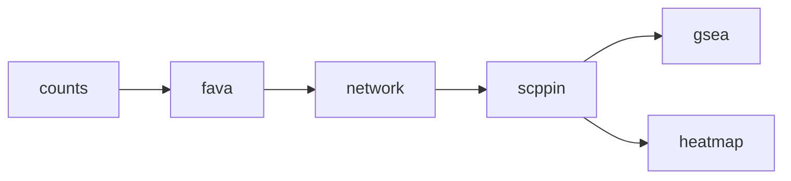

# pcst-ad

Snakemake pipeline for PCST (Prize-Collecting Steiner Tree) analysis of Alzheimer's disease single-cell RNA-seq data. Identifies protein-protein interaction networks using FAVA and STRING database.

## Pipeline Overview



### Workflow Steps

- **counts**: Extract cell-type specific expression data filtered by MAGMA GWAS genes
- **fava**: Compute gene-gene co-expression scores using FAVA (GPU-accelerated)
- **network**: Compute differential correlation (Fisher z-transformation) between Control and AD conditions, filter by STRING protein-protein interactions
- **scppin**: Prize-Collecting Steiner Tree module detection using MAGMA p-values as node weights
- **gsea**: Gene set enrichment analysis on detected modules
- **heatmap**: Cross-cell-type module comparison using Jaccard similarity

## Input Data

Required input files in `input/` directory:

- `magma_gene_symbol_results.tsv` - GWAS gene-level association results from MAGMA
- `GSE174367_snRNA-seq_cell_meta.csv` - Single-cell RNA-seq metadata with cell type and diagnosis annotations
- `GSE174367_snRNA-seq_filtered_feature_bc_matrix.h5` - Expression count matrix in 10x Genomics format

## Configuration

Create a `config.yaml` file:

```yaml
BUCKET: gs://your-bucket

CONDITIONS:
  - Control
  - AD

CELLTYPES:
  - ODC
  - EX
  - INH
  - ASC
  - MG
  - OPC
  - PER.END

# GPU settings for fava rule
GPU_TYPE: nvidia-tesla-t4
GPU_MACHINE_TYPE: n1-highmem-2
GPU_BOOT_IMAGE: projects/rocky-linux-accelerator-cloud/global/images/family/rocky-linux-8-optimized-gcp-nvidia-latest

# GSEA gene sets
GENE_SETS:
  - Reactome_2022
  - DisGeNET
```

## Output Files

### Per Cell Type (`output/{celltype}/`)
- `{condition}_anndata.h5ad` - Filtered AnnData object with highly variable genes
- `{condition}_fava_pairs.tsv` - Gene pair co-expression scores
- `network.tsv` - Differential correlation network filtered by STRING PPI
- `scppin_object.pkl` - PCST module detection results
- `module_gsea_enrichment.tsv` - Pathway enrichment results

### Figures (`figures/`)
- `{celltype}/{condition}_fava_histogram.png` - Distribution of FAVA scores
- `module_jaccard_heatmap.png` - Cross-cell-type module similarity heatmap

## Usage

### Local execution
```bash
snakemake --use-conda
```

### Google Cloud Platform execution
```bash
snakemake --profile profiles/gcp
```
