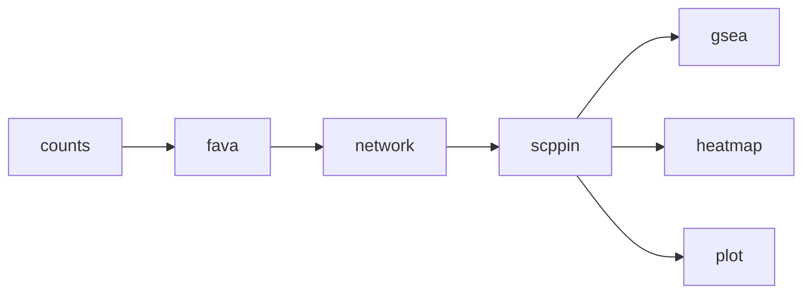

# pcst-ad

[](https://doi.org/10.5281/zenodo.18319511)

Snakemake pipeline for identifying Alzheimer's disease-relevant protein modules by integrating three data modalities:

- **Edges**: Protein-protein interactions from STRING database
- **Edge weights**: Differential co-expression scores from FAVA (Control vs AD)
- **Node weights**: Gene-level p-values from MAGMA (AD GWAS)

The Prize-Collecting Steiner Tree (PCST) algorithm builds connected gene networks by balancing strong genetic signals against the cost of traversing weaker disease-specific co-expression links.

## Pipeline Overview



### Workflow Steps

- **counts**: Extract cell-type specific expression data filtered to MAGMA GWAS genes
- **fava**: Compute gene-gene co-expression scores for Control and AD conditions (GPU-accelerated)
- **network**: Compute differential correlation using Fisher z-transformation, filter edges to known STRING protein-protein interactions
- **scppin**: PCST module detection—edges weighted by differential co-expression, nodes weighted by GWAS significance
- **gsea**: Gene set enrichment analysis on detected modules
- **heatmap**: Cross-cell-type module comparison using Jaccard similarity
- **plot**: Visualize detected modules as network graphs with nodes colored by GWAS p-value significance

## Input Data

Required input files in `input/` directory:

- `magma_gene_symbol_results.tsv` - GWAS gene-level association results from MAGMA
- `GSE174367_snRNA-seq_cell_meta.csv` - Single-cell RNA-seq metadata with cell type and diagnosis annotations
- `GSE174367_snRNA-seq_filtered_feature_bc_matrix.h5` - Expression count matrix in 10x Genomics format

## Configuration

Create a `config.yaml` file:

```yaml
BUCKET: gs://your-bucket

CONDITIONS:
  - Control
  - AD

CELLTYPES:
  - ODC
  - EX
  - INH
  - ASC
  - MG
  - OPC
  - PER.END

# GPU settings for fava rule
GPU_TYPE: nvidia-tesla-t4
GPU_MACHINE_TYPE: n1-highmem-2
GPU_BOOT_IMAGE: projects/rocky-linux-accelerator-cloud/global/images/family/rocky-linux-8-optimized-gcp-nvidia-latest

# GSEA gene sets
GENE_SETS:
  - Reactome_2022
  - DisGeNET

# STRING cutoff
STRING_CUTOFF: 500
```

## Output Files

### Per Cell Type (`output/{celltype}/`)
- `{condition}_anndata.h5ad` - Filtered AnnData object with highly variable genes
- `{condition}_fava_pairs.tsv` - Gene pair co-expression scores
- `network.tsv` - Differential correlation network filtered by STRING PPI
- `scppin_object.pkl` - PCST module detection results
- `module_gsea_enrichment.tsv` - Pathway enrichment results

### Figures (`figures/`)
- `{celltype}/{condition}_fava_histogram.png` - Distribution of FAVA scores
- `{celltype}/module_network.png` - Network visualization of detected module with GWAS p-value coloring
- `module_jaccard_heatmap.png` - Cross-cell-type module similarity heatmap


## Usage

### Local execution
```bash
snakemake --use-conda
```

### Google Cloud Platform execution
```bash
snakemake --profile profiles/gcp
```

## Data Sources

**GWAS Data:**
- Bellenguez et al. (2022). "New insights into the genetic etiology of Alzheimer's disease and related dementias." *Nature Genetics*, 54, 412-436.
- Link: https://www.nature.com/articles/s41588-022-01024-z
- MAGMA gene-level results derived from this GWAS

**Single-cell RNA-seq Data:**
- Morabito et al. (2021). "Single-nucleus chromatin accessibility and transcriptomic characterization of Alzheimer's disease." *Nature Genetics*, 53, 1143-1155. (GEO: GSE174367)
- Link: https://www.nature.com/articles/s41588-021-00894-z

**STRING Database:**
- Protein-protein interaction network (v11.5)
- Link: https://string-db.org
